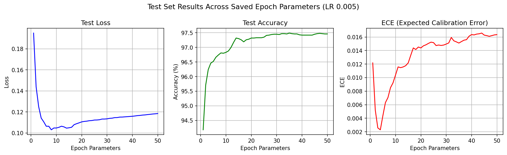
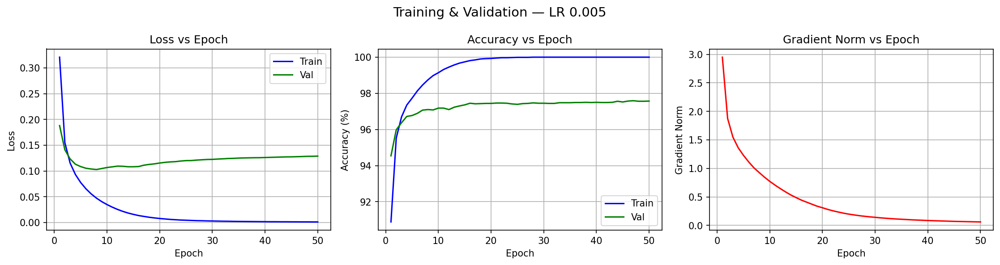
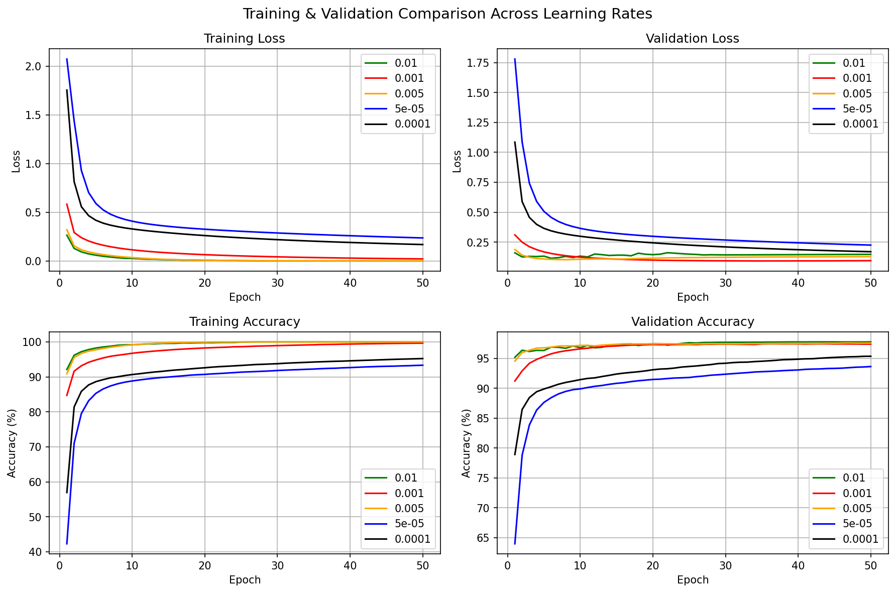
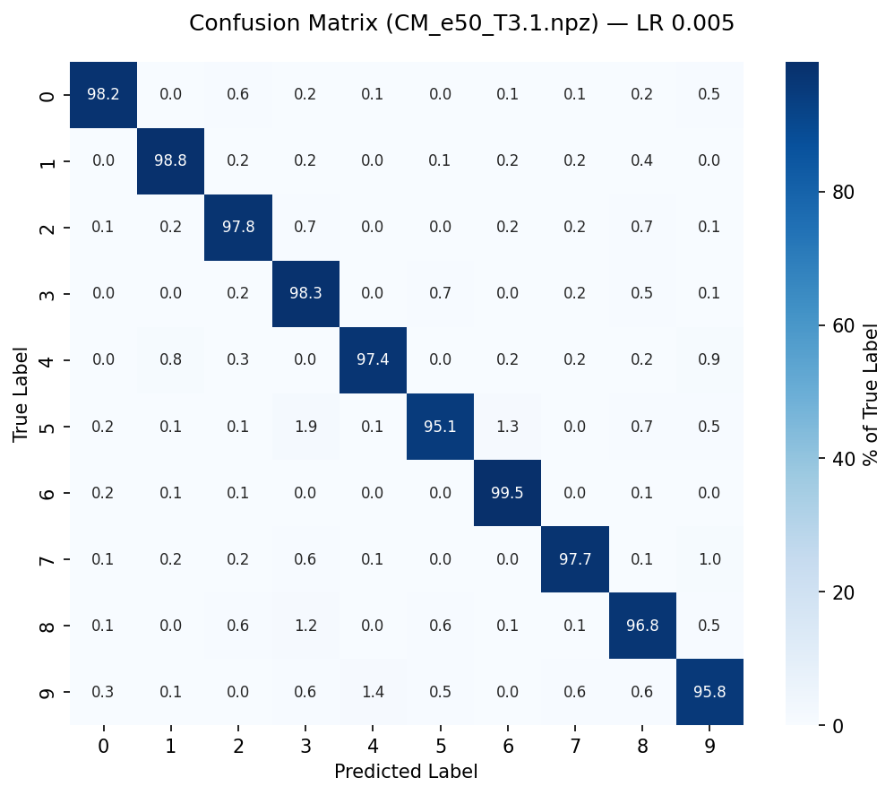
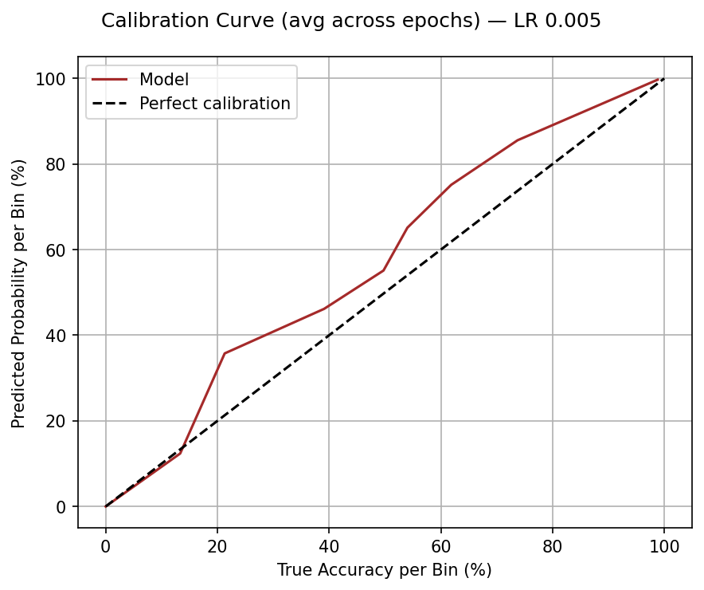

# MNIST Digit Classifier

A from-scratch neural network trained on the MNIST handwritten digit dataset, built using only NumPy. No deep learning frameworks — all forward propagation, backpropagation, and gradient descent implemented manually.

**Live demo:** https://mnist-digit-classifier.fly.dev


## Architecture

```
Input (784) → Hidden Layer (64, ReLU) → Output (10, Softmax)
```

- **Loss:** Cross-entropy
- **Optimizer:** SGD
- **Dataset split:** 50,000 training / 10,000 validation / 10,000 test
- **Calibration:** Temperature scaling applied post-training

## Results

Best model achieves **97.5% test accuracy** at LR 0.005.

### Test Set Performance



Loss, accuracy, and ECE (Expected Calibration Error) evaluated across saved epoch checkpoints.

### Training & Validation



Loss, accuracy, and gradient norm over 50 epochs at LR 0.005.

### Learning Rate Comparison



Training and validation curves compared across 5 learning rates (0.01, 0.005, 0.001, 0.0001, 0.00005).

### Confusion Matrix



Per-class accuracy breakdown on the test set. Strongest on 6s (99.5%), weakest on 5s (95.1%).

### Calibration Curve



Compares the model's predicted confidence against its actual accuracy. A perfectly calibrated model follows the diagonal.

## Project Structure

| File | Description |
|---|---|
| `MNIST-2.0.py` | Main training script — training, validation, logging, LR finder, temperature scaling |
| `MNIST.py` | Original implementation, kept as reference |
| `MNIST.test.py` | Inference on the held-out test set |
| `graphing.py` | Plots loss, accuracy, calibration curves, and confusion matrices |
| `Deployment/` | Web app for drawing digits and getting predictions |

## Deployment

The web app uses a FastAPI backend serving a canvas-based frontend where you can draw digits and get predictions.

```
Deployment/
├── Backend/
│   ├── app.py              # FastAPI server
│   └── MNISTMODEL.py       # Inference wrapper
├── Frontend/
│   ├── MNIST.html           # Drawing canvas UI
│   ├── MNIST.css
│   └── MNIST.js
├── Dockerfile
└── fly.toml                 # Fly.io deployment config
```

### Run locally

```bash
cd Deployment
pip install -r Backend/requirements.txt
uvicorn Backend.app:app --host 0.0.0.0 --port 8080
```

### Run with Docker

```bash
cd Deployment
docker build -t mnist .
docker run -p 8080:8080 mnist
```

## Dataset

Place the MNIST `.idx` files in the root directory. Available from [Wikiwand](https://www.wikiwand.com/en/articles/MNIST_database).

## Requirements

**Training, validation, and testing:**
```
numpy, idx2numpy
```

**Plotting and analysis:**
```
matplotlib, pandas, seaborn
```
